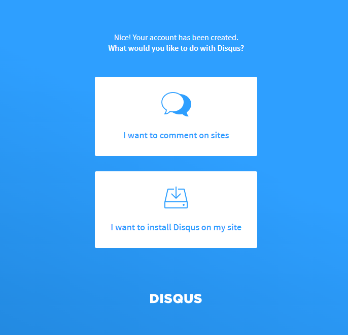
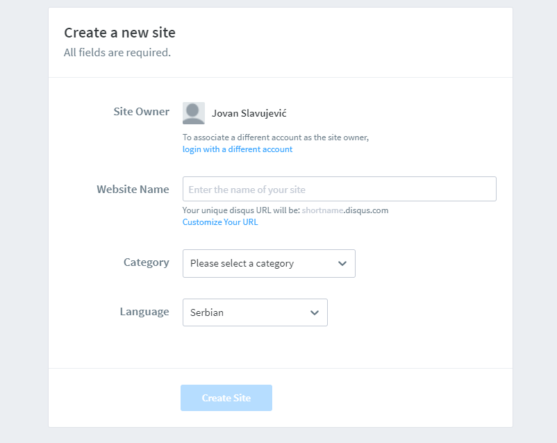
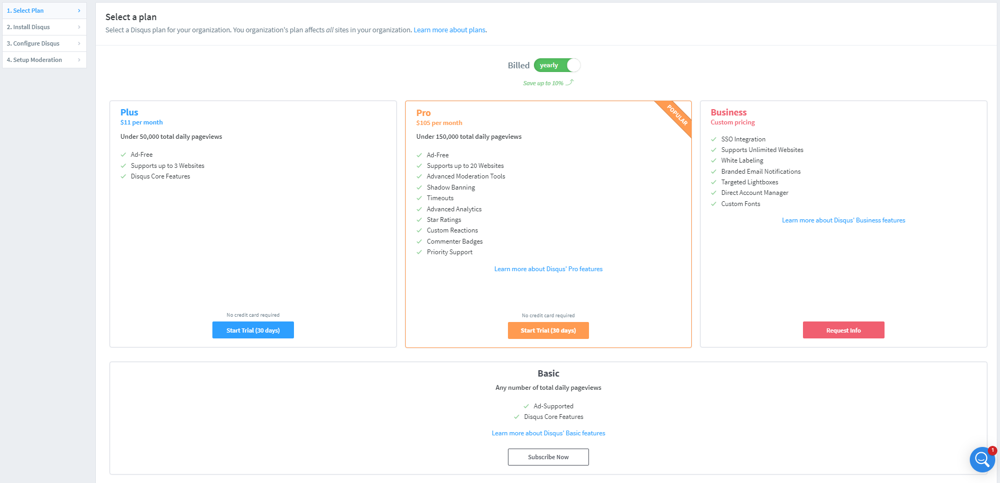
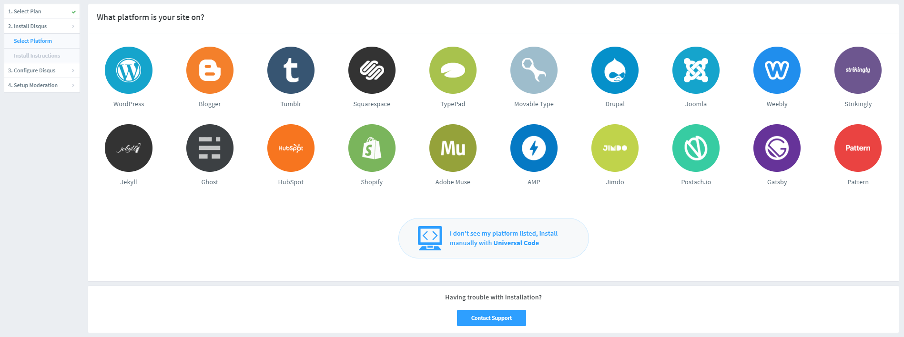

# How to setup DISQUS to your project

* GO TO <a href="https://disqus.com/">Disqus HOME PAGE</a>

* Create account (sign up)

* After that select <strong>I want to install Disqus on my site</strong>

* Create (register) new web-site (i.e. Website Name: "seoblog" & Category : "News")

* Select Plan (subscribe to basic)

* Select Platform (if you don't see it, select <strong>install manually with Universal code</strong> which will forward you to "INSTRUCTION" page)

* Go to <a href="https://github.com/kriasoft/react-starter-kit/blob/master/docs/recipes/how-to-integrate-disqus.md">this page</a>

* Copy DisqusThread from previous page and install dependencies (prop-types npm package)
> $ npm i prop-types

* Update DisuqsThread from previous page by adding DISQUS SHORTNAME & WEBSITE URL (DOMAIN). DISQUS SHORTNAME can be found within "INSTRUCTION" page in embed URL,   i.e. 'https://seoblog-tflljh3cad.disqus.com/embed.js'

