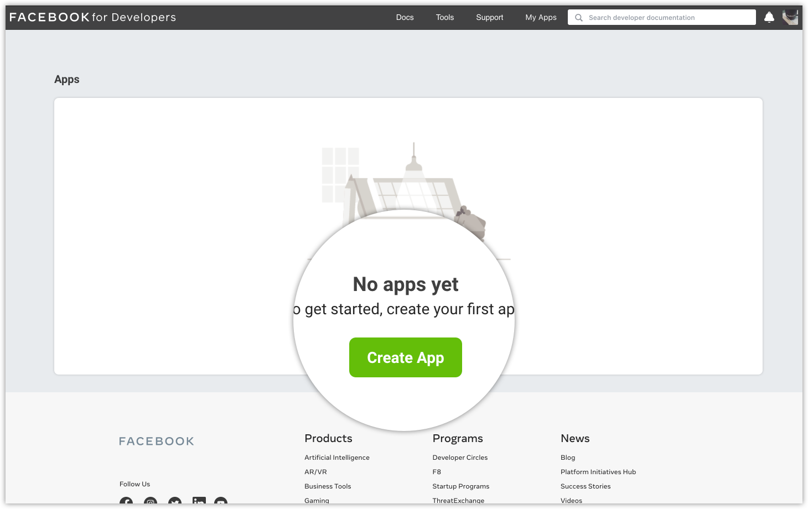

# Create an App

The app creation flow gathers the minimum amont of information needed to generate a unique ID for your app. Once you complete the flow you will end up in the App Dashboard where you can provide additional information about your app, or <a href="https://developers.facebook.com/docs/development/build-and-test">start building and testing</a> right away.

## Before You Start

You must be logged into you <a href="https://developers.facebook.com/docs/development/register">Facebook developer account</a>.

## Step 1: Start the app creation process

If you just came from the registration flow, click the <strong>Create First App</strong> button.

Otherwise, go to the <a href="https://developers.facebook.com/apps">Apps</a> panel and clik <strong>Create App</strong>.

## Step 2: Choose an app type

Your app type determines which products and APIs are available to your app. If this is your first time creating an app and you are just exploring the app creation flow, choose the <strong>None</strong> option. Later, when you are more familiar with our products and APIs, refer to our <a href="https://developers.facebook.com/docs/development/create-an-app/app-dashboard/app-types">app types</a> document to determine which app type is best suited for your app, then create a new app and choose an appropriate type.

## Step 3: Set your app name and email

Enter the name of your app and an email address where we can send you any important developer notifications. The email address can be different from the email address associated with your Facebook account, just make sure it's valid and that you monitor it, since all important developer notifications will be sent there.

You can also add a <a href="https://www.facebook.com/business/help/113163272211510">Facebook Business Manager account</a> if you have one, theh click <strong>Create App</strong>.

Once you have completed the app creation flow your app will be loaded in the App Dashboard.

## Next Steps

Now that you have created your app you can start building and testing. You can also explore the App Dashboard and provide additional information about your app, but it's not necessary to start building. You can always return the dashboard and adjust settings as they are needed.
